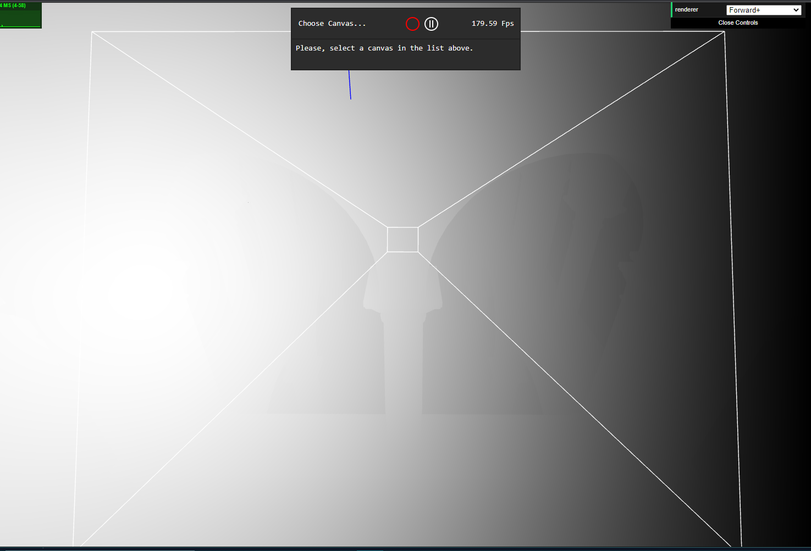
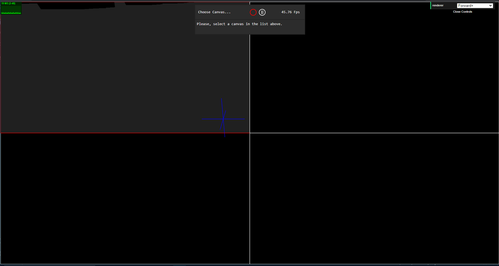
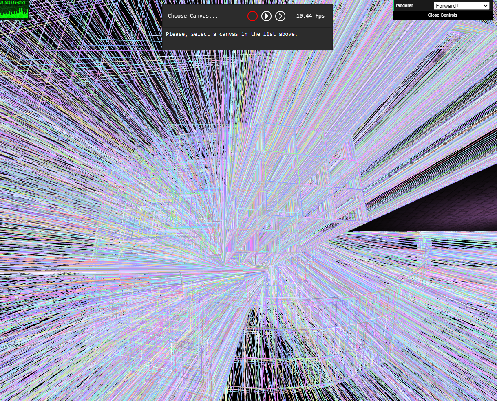

WebGL Forward+ and Clustered Deferred Shading
======================

**University of Pennsylvania, CIS 565: GPU Programming and Architecture, Project 5**

* Ashley Alexander-Lee
* Tested on: Windows 10, i9-11900H @ 2.50GHz 22GB, RTX 3070 

### Live Online

[Live Demo](https://asalexan.github.io/Project5-WebGL-Forward-Plus-and-Clustered-Deferred/)

### Demo Video/GIF

### Description
The purpose of this project was to improve the rendering time for WebGL scenes that have many light/material combinations using Forward+ rendering and Clustered Deferred rendering. With simple forward rendering, every light/material combination must be taken into account for multiple fragments. For both Forward+ and Clustered Deferred rendering, the idea is that you can split the viewing frustum into clusters and sort the lights into said clusters. Then, during the shading stage, you only need to perform lighting calculations for the lights contained in the cluster the fragment belongs to. Clustered Deferred takes this a step farther. Instead of doing the shading calculations in the fragment shader, it saves certain fragment attributes to a gbuffer, which is ported to a post-process shader that can perform the lighting calculations. The benefit of this method is that it does not have to perform costly calculations for multiple fragments per pixel -- it only needs to perform these calculations for the final pixel color. 

### Approach

#### Cluster Creation
First, I needed to split the viewing frustum into clusters. I wrote a `Subfrustum` class that would handle these calculations and that would, given a wireframe object, display the frustums and light positions. A subfrustum contains six `SubfrustumPlane`s, which, in turn, contain four points and a three.js plane. The `SubfrustumPlane` has the ability to:

* calculate whether a given light intersects a plane
* calculate whether a given light is inside a plane (if the vector between the light position and the plane faces away from the normal)

The parent `Subfrustum` class takes in six values to create the frustum: `minX`, `minY`, `minZ`, `maxX`, `maxY`, `maxZ`. It organizes these values into points and projects those points based off of the method describe in this [blog post](https://dev.theomader.com/frustum-splits/). It also has a function to determine if a light sphere overlaps a frustum, which checks if either 1) the sphere overlaps one of the bounded planes or 2) the sphere lies inside of the frustum (i.e. it's inside all of the frustum planes). This intersection method was guided by this [stack overflow post](https://stackoverflow.com/questions/37512308/choice-of-sphere-frustum-overlap-test) enumerating the different ways a sphere could overlap a frustum. 

I also have methods in these classes for displaying the subfrustums and the surrounding lights. Below, you can see a visualization of a 15 x 15 x 15 frustum -- the blue crosses represent light positions, and the red highlights represent the frustums that are intersected by a light. 

#### Forward+
I created a new texture to contain the coordinates of each cluster (4 * 8 elements). In the fragment shader, I unpack the cluster points from the texture and create a `Cluster` which is composed of six `Plane`s, as per my earlier method. I then perform a similar method as above to ascertain whether the fragment position is inside the cluster. If so, I return the cluster ID. The cluster ID is then used to unpack the texture containing the lights per cluster. I iterate over the number of lights in that cluster and perform the lighting calculations with just those lights. 

Theoretically, this is how it should work -- I have written code to this extent. However, I had difficulty identifying the cluster to which the fragment belongs. I used the same method as in my Subfrustum class, however, the fragment seems to always belong to the first cluster. I tried debugging this by visualizing the dot product between the direction of the point to the plane and the normal, like so:

You can see the outline of the architecture, but all of these dot values are positive. This is to be expected if there is only one frustum, as shown here, since all of the geometry in view must belong to our viewing frustum. However, when I visualize the cluster ID belonging to each fragment (cluster ID / total clusters), I just see one cluster used:

Much more work needs to be done to find this bug -- to see the rest of my clustering process, you can look at the commented out code in `forwardPlus.frag.glsl.js`.

#### Clustered Deferred
Since I encountered the clustering bug described above, this is simple a deferred algorithm. In the fragment shader, I save the position, normal, and albedo to a gbuffer, and extract those values in my post-process shader. I then perform the lighting calculations on the final pixel. Just at a glance, I noticed a few FPS improvement in the runtime, which can be explained by not having to do multiple fragment calculations per pixel.

### Performance

#### Forward vs. Deferred
Since I hit a roadblock on clustering, I will provide analysis for forward vs. deferred rendering, and then extrapolate to Forward+ and Clustered Deferred. In terms of a side-by-side comparison, deferred rendering was faster:

|    | Forward | Deferred | 
| -- | ------- | -------- |
| Average FPS | 20.5 FPS | 22.5 FPS |

However, if we use Chrome's performance tools, we can see a more nuanced picture in terms of how effort is spent (within a 2.19s time period):

|   | Forward | Deferred |
| - | ------- | -------- |
| Scripting | 56 ms | 2112 ms |
| Rendering | 2 ms | 2 ms |
| Painting | 4 ms | 3 ms |
| System | 12 ms | 8 ms |
| Idle | 2120 ms | 66 ms |

You'll notice that Forward is spending more time idle than scripting and vice-verse for Deferred. Let's keep in mind that `updateClusters()`, which splits the viewing space into clusters, is being run for both, so that isn't the differentiator. What I noticed in the profiler is that `updateClusters()` is called once, along with its helper functions, in Forward, while, for Deferred, it's being called numerous times consecutively. My best guess is that Forward is waiting for the GPU to finish its task before processing the next frame, so it's spending time idle. On the other hand, the GPU needs to work a little less for deferred, since it has to do fewer calculations per pixel. Therefore, the deferred renderer is spending more time working than idle (leading to a better FPS). 

Therefore, the benefit of using Forward over Deferred is that your system doesn't have to work nearly as hard per ms. It also doesn't use as much memory, since deferred requires additional gbuffers for all pixel data. So, if you want to minimize memory usage, Forward is the better option. However, Deferred is beneficial over Forward since it achieves a better FPS, and can get work accomplished more quickly and efficiently. 

#### Forward+ vs Clustered Deferred
Now, the performance evaluation above is based on rendering *without* clustering. We want to try to evaluate what will happen if we add in clustering for both. Once the scene is split into clusters, if the lights are uniformly scattered, it's likely that each cluster will have balanced numbers of lights, splitting the number of lights we have to evaluate in the shader by `numClusters`. 

We don't want to use too many clusters, as it will increase the amount of time the system spends on scripting tasks, which is already the majority of the work time. However, if we choose the right number of clusters, we can greatly increase the performance. For instance, if we take the default settings, 100 lights and 15 * 15 * 15 clusters, we see that each cluster probably only needs to deal with 1 - 2 lights, depending on the radius of the lights. I imagine this will *at least* halve the time spent on GPU tasks. I would guess that the idle time for Forward would halve for Forward+, and the scripting time would increase, making the runtime more similar to Deferred. 

Clustered Deferred, however, is limited by its scripting time, which, you'll notice, takes up the majority of the 2.19s. So, a boost in GPU productivity isn't likely to improve performance much, since there's a CPU bottleneck. So, if I had time to work on this, I would try to decrease that scripting time to improve throughput. 

In the case of Forward+ vs Clustered Deferred, Forward+ is likely better for tasks that require less memory usage, since it doesn't require massive amounts of space for gbuffers for each pixel. However, if performance is the goal, Clustered Deferred still results in better performance, since time spent on the GPU is minimal. 

The only optimization I was able to achieve was to store the cluster positions compactly in a texture, and extract them adjacently. 

### Credits
* [Frustum Splits](https://dev.theomader.com/frustum-splits/) by theo
* [Three.js](https://github.com/mrdoob/three.js) by [@mrdoob](https://github.com/mrdoob) and contributors
* [stats.js](https://github.com/mrdoob/stats.js) by [@mrdoob](https://github.com/mrdoob) and contributors
* [webgl-debug](https://github.com/KhronosGroup/WebGLDeveloperTools) by Khronos Group Inc.
* [glMatrix](https://github.com/toji/gl-matrix) by [@toji](https://github.com/toji) and contributors
* [minimal-gltf-loader](https://github.com/shrekshao/minimal-gltf-loader) by [@shrekshao](https://github.com/shrekshao)

### Bloopers

A million frustums! If you forget to destroy your wireframe on each tick, this colorful image is the result.
